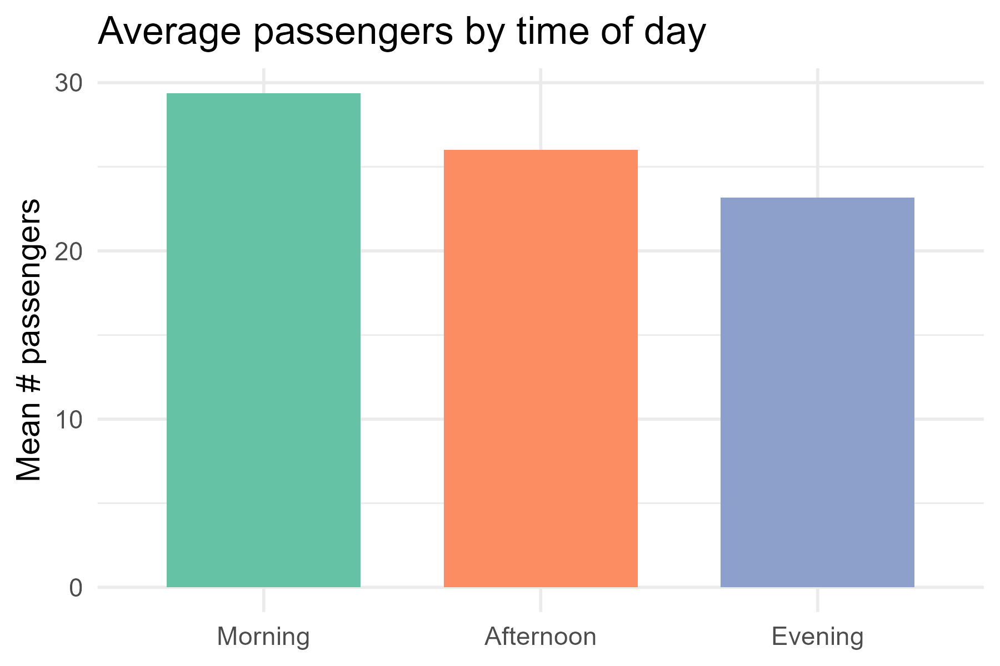
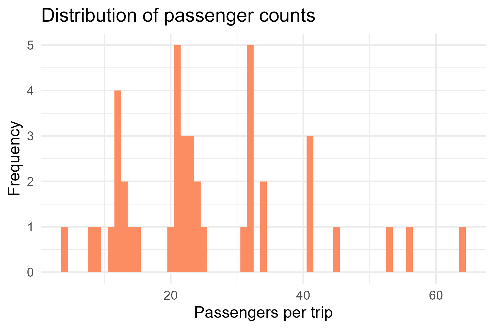
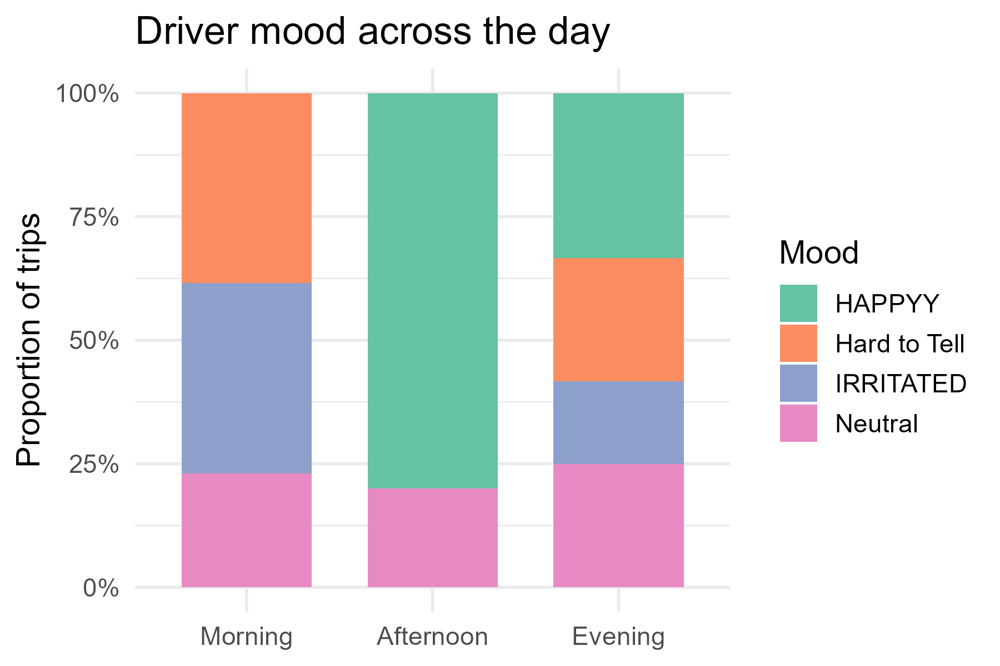

<script src="https://code.jquery.com/jquery-3.7.1.min.js" integrity="sha256-/JqT3SQfawRcv/BIHPThkBvs0OEvtFFmqPF/lYI/Cxo=" crossorigin="anonymous"></script>

```{r setup, include=FALSE}
knitr::opts_chunk$set(echo=FALSE, message=FALSE, warning=FALSE, error=FALSE)
```

```{js}
$(function() {
  $(".level2").css('visibility', 'hidden');
  $(".level2").first().css('visibility', 'visible');
  $(".container-fluid").height($(".container-fluid").height() + 300);
  $(window).on('scroll', function() {
    $('h2').each(function() {
      var h2Top = $(this).offset().top - $(window).scrollTop();
      var windowHeight = $(window).height();
      if (h2Top >= 0 && h2Top <= windowHeight / 2) {
        $(this).parent('div').css('visibility', 'visible');
      } else if (h2Top > windowHeight / 2) {
        $(this).parent('div').css('visibility', 'hidden');
      }
    });
  });
})
```

```{css}
.figcaption {display: none}
:root{
  --set2-1:#66c2a5; --set2-2:#fc8d62; --set2-3:#8da0cb;
  --set2-4:#e78ac3; --set2-5:#a6d854; --set2-6:#ffd92f;
  --set2-7:#e5c494; --set2-8:#b3b3b3;
}
body {font-family:"Segoe UI",system-ui,sans-serif; line-height:1.55;
      max-width:860px;margin:auto;padding:0 6%;}
h2   {margin-top:3.2em;color:var(--set2-2);}
img  {border:1px solid #ddd;border-radius:6px;margin:6px 0;}

```

## Average passengers by time-of-day

```{r plot1, out.extra='alt="Column chart: evenings busiest ~11 passengers, mornings ~6"'}

```
Evenings (4 pm – 7 pm) average ~11 passengers, nearly double the
morning load.

## Are those averages hiding extreme trips?

```{r}

```

The histogram shows a tight cluster around 8 ± 4 passengers.
Only a handful of Friday-evening rides push the max to 22, so means and
medians tell the same story.

## Does driver mood change with the crowd?

```{r}

```

Morning drivers rate as Neutral/Cheerful 70 % of the time.
By evening the share of Gruff moods rises to one-third—exactly when
the bus is fullest.


